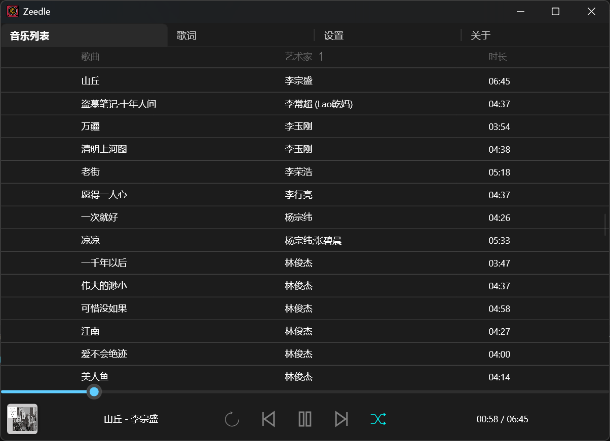
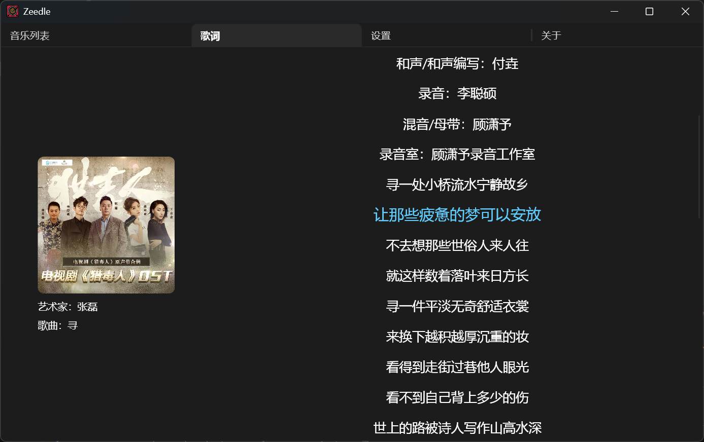

  <picture align="center">
    
  </picture>

 
    <b>Zeedle</b> 
    即刻的音乐体验，为纯粹的简约而设计 
    基于 <a href="https://github.com/RustAudio/rodio">Rodio</a> 和 <a href="https://slint.dev">Slint UI</a> 构建

在 0.5 秒内享受音乐：
- ⚡ 即刻启动 — 点开就能听。
- 🎶 本地专注 — 轻量、无干扰。
- ✨ 极简暗色界面 — 只留下音乐，清晰纯粹。

## 安装
### Windows
下载预编译的发行版。
### 其他平台
从源码构建。应当支持主流平台，如 Windows、Linux 和 MacOS。

## 配置
输入你的音乐目录路径，然后按 **Enter**：

## 享受

歌词显示：

## 注意
Zeedle 也是 Rust GUI 初学者的理想入门项目。
它轻量、实用、足够简单，可以帮助初学者在做出有用东西的同时获得真实的上手体验。🤗🤗🤗
