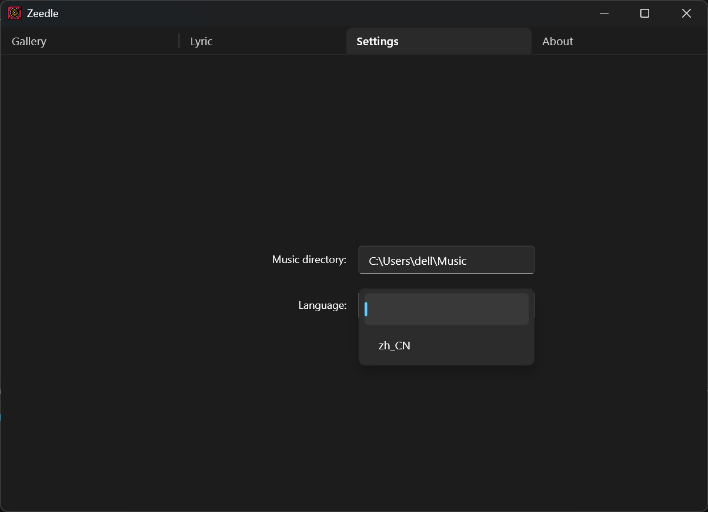
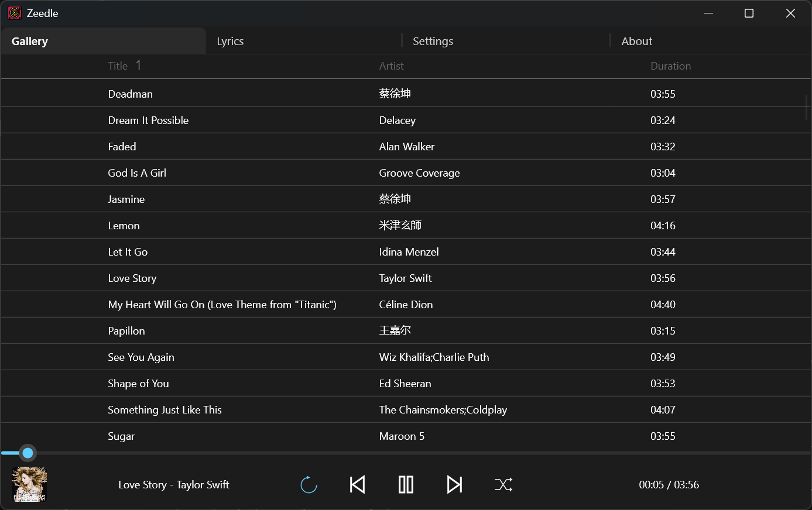
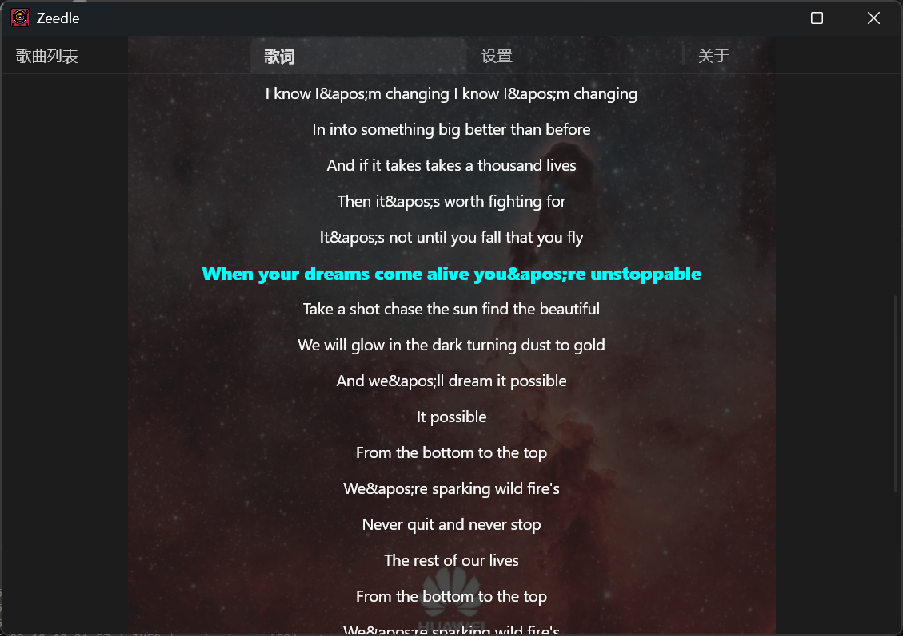

  <picture align="center">
    
  </picture>

 
    <b>Zeedle</b> 
    Music at the speed of a blink, designed for pure simplicity 
    Built by <a href="https://github.com/RustAudio/rodio">Rodio</a> and <a href="https://slint.dev">Slint UI</a> 

Enjoy your music in less than 0.5s:
- ⚡ Instant startup — your music begins the moment you click.
- 🎶 Local focus — lightweight and distraction-free.
- ✨ Minimal Dark UI — nothing but your music, beautifully clear.
- 🦜 Multiple language support — English/Chinese.
- ⌨️ Hotkey support — total freedom, no mouse needed.

<a href="README-zh.md">中文介绍</a> can be seen here.

## Installation
### Windows
Download prebuilt releases.
### Other platforms
Build from source. It should support main platforms like Windows, Linux and MacOS. 

## Config
Input your music directory path, and **Enter**:

## Enjoy

Lyrics Display:

## Note
Zeedle is also an ideal starter project for anyone new to Rust GUI development.
It’s lightweight, practical, and simple enough to help beginners gain real hands-on experience while building something useful. 🤗🤗🤗

After typing it, you can get: 
- how to use Rodio playback library to play audios
- how to communicate between UI and backend threads
- how to add hotkey bindings in Slint UI
- how to support multiple languages in Slint UI
